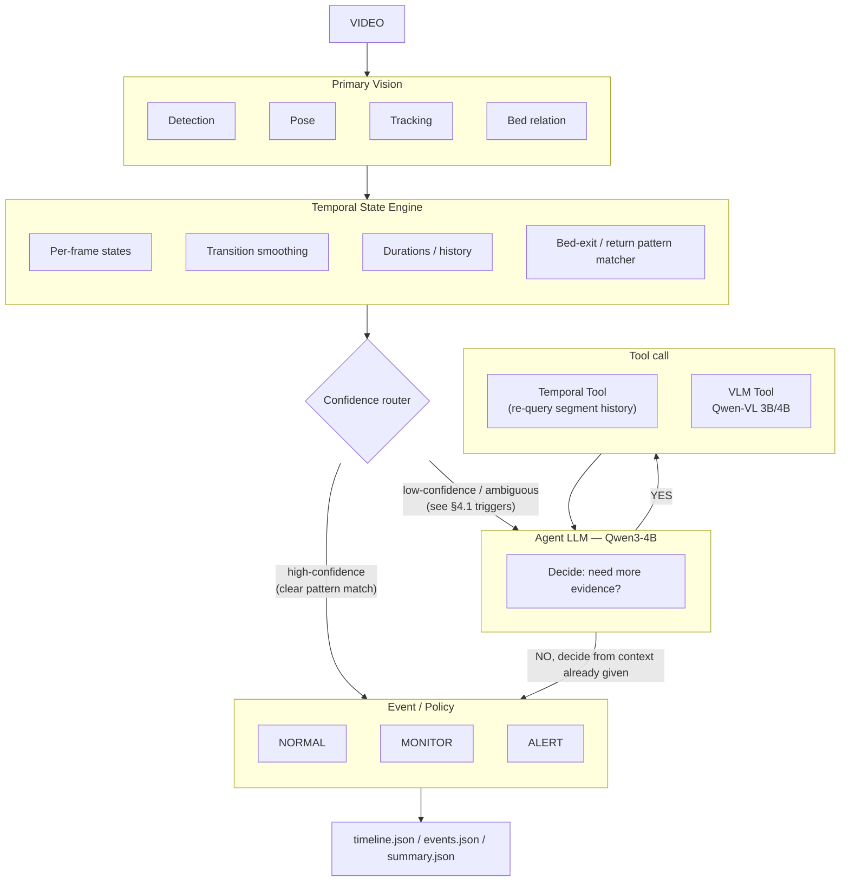

# Elderly Bed-Monitoring System — Design Spec for Implementation

**Audience:** a coding agent building this from scratch. Follow this spec exactly; where it's silent, make the simplest choice that satisfies the acceptance criteria in §10, and note the choice in the README rather than asking.

**Source requirement:** Associate AI/ML Engineer assignment — analyze a continuous indoor video of an elderly person, determine activity states, bed exit/return events, durations, and a monitoring decision (NORMAL / MONITOR / ALERT), using vision + agentic reasoning rather than a trained-from-scratch classifier.

---

## 1. Architecture



### 1.1 Why the router is explicit (not every event goes to the LLM)

The brief's own worked example (§5, "Agentic Analysis") is specifically about *ambiguous* cases — a frame that alone can't confirm a bed exit. A clean, unambiguous sequence (lying → sitting → standing → walking → out of frame, all with high keypoint confidence and no conflicting signals) should resolve straight from the Temporal State Engine's pattern matcher, with **no LLM call**. Only route to the Agent LLM when the pattern matcher itself is uncertain. This keeps the system fast, cheap, and — more importantly for the interview — gives you a clean, defensible answer to "why did this event need agentic reasoning and this other one didn't."

### 1.2 Module boundaries (own this exactly — these become your file/module split)

| Module | Owns | Does NOT own |
| --- | --- | --- |
| Primary Vision | per-frame detection, pose, track ID, bed-overlap % | any temporal reasoning, any state label |
| Temporal State Engine | raw→smoothed state mapping, segment building, durations, bed-exit/return pattern matching, confidence scoring | calling the LLM, alert decisions |
| Confidence router | routing only — a pure function of the TSE's own confidence output | vision, LLM logic |
| Agent LLM | deciding whether more evidence is needed, calling tools, producing a final confirmed event + confidence | vision inference, alert thresholds |
| Tools (Temporal, VLM) | answering specific, bounded questions the agent asks | deciding anything itself |
| Event / Policy | turning confirmed events + durations into NORMAL/MONITOR/ALERT | vision, LLM |

---

## 2. Data contracts

Every arrow in the diagram is a serializable object. Implement these as dataclasses (or pydantic models) — whichever the agent doing this build already has conventions for.

```python
# Primary Vision -> Temporal State Engine
@dataclass
class FrameObservation:
    t: float                    # seconds from video start
    track_id: Optional[int]     # None if nobody detected this frame
    bbox: Optional[Tuple[float,float,float,float]]
    keypoints: Optional[np.ndarray]   # (17,3) x,y,conf — COCO layout
    bed_overlap: float          # 0..1, fraction of person area over bed region
    mean_kpt_conf: float

# Temporal State Engine -> router / Agent LLM
@dataclass
class StateSegment:
    start_t: float
    end_t: float
    state: str                  # one of the 7 states, see §3
    confidence: float           # 0..1
    ambiguous_reason: Optional[str]  # set only if confidence is low, see §4.1

# Agent LLM / Policy -> output
@dataclass
class BedEvent:
    event: str                  # "bed_exit" | "bed_return"
    start_time: str             # HH:MM:SS
    confirmed_time: str
    previous_state: str
    current_state: str
    confidence: float
    decision: str                # NORMAL | MONITOR | ALERT
    tool_trace: List[dict]       # every tool call the agent made, for auditability
```

---

## 3. States (Primary Vision → Temporal State Engine)

Implement exactly these 7, mapped from posture × bed-relation:

```
LYING_IN_BED | SITTING_ON_BED | SITTING_OUTSIDE_BED | STANDING | WALKING | OUT_OF_BED | UNKNOWN
```

**Do not classify frame-by-frame independently.** The Temporal State Engine must smooth raw per-frame guesses into segments before anything downstream sees a "state" — this is a hard requirement from the brief (§1: *"understand transitions rather than independently classifying every frame"*).

Minimum smoothing rule: a state only "counts" once it's held for `MIN_SEGMENT_SEC` (default 2.0s, configurable) — collapse shorter blips into the neighboring segment or mark them `UNKNOWN` if they don't match either side.

`UNKNOWN` is a legitimate, expected output, not a failure — use it whenever `mean_kpt_conf` is below a threshold (default 0.25) or the posture/bed-overlap signals conflict. Never force a classification the evidence doesn't support (brief §8).

---

## 4. Temporal State Engine internals

### 4.1 Confidence scoring — what makes something "ambiguous"

A `StateSegment` gets low confidence (routes to the Agent LLM) when **any** of these hold:

- `mean_kpt_conf` averaged over the segment is below 0.4
- the segment is right at a **candidate bed-exit or bed-return boundary** (see pattern matcher below) — these are exactly the cases the brief's worked example covers
- bed-overlap hovers near the in/out threshold (within ±0.1 of the cutoff) for a sustained period — the "sitting on the edge" case (brief §6, MONITOR example)
- the segment's state conflicts with what a naive geometry check alone would say (e.g. horizontal posture detected off-bed — could be `OUT_OF_BED` or a fall, brief §8 difficult cases)
- track ID was lost and re-acquired within the segment (possible caregiver interference, brief §8)

Everything else resolves directly to Event/Policy with no LLM call.

### 4.2 Bed-exit / bed-return pattern matcher

This is a **named sub-component**, not generic transition logging — implement it as its own small state machine watching the segment stream:

```
BED_EXIT candidate:
  {LYING_IN_BED | SITTING_ON_BED} → STANDING → {WALKING | OUT_OF_BED}
  sustained for >= MIN_EXIT_CONFIRM_SEC (default 3s) moving away from bed

BED_RETURN candidate:
  {WALKING | STANDING | OUT_OF_BED} → approaching bed →
  {SITTING_ON_BED → LYING_IN_BED} within RETURN_WINDOW_SEC (default 30s)
```

Explicitly **reject** (do not fire an event for) these patterns, per brief §2 and §8:

- `LYING_IN_BED → SITTING_ON_BED → LYING_IN_BED` within a short window (sitting up, not leaving)
- `{SITTING_ON_BED|LYING_IN_BED} → STANDING → SITTING_ON_BED` without an intervening `WALKING`/`OUT_OF_BED` segment (stood briefly, sat back down)
- any transition where `bed_overlap` never drops below threshold

If the pattern matcher can't confidently classify a transition as confirm/reject, that's exactly the low-confidence case routed to the Agent LLM — it doesn't have to guess.

---

## 5. Agent LLM (Qwen3-4B)

### 5.1 What it receives

The ambiguous `StateSegment` plus a fixed window of context: the smoothed segment history for `[t - 30s, t + 30s]` around the ambiguous point, already computed — the agent should not need a tool call just to see recent history, only to dig further than what's handed to it.

### 5.2 Decision loop

```
1. Given: ambiguous segment + surrounding context
2. Agent decides: is the given context sufficient to confirm/reject the
   candidate event and assign a state + confidence?
   - YES -> emit decision directly, skip tools entirely
   - NO  -> call exactly one tool, inspect result, re-decide
             (max TOOL_CALL_LIMIT = 4 per ambiguous segment — hard cap to
             bound latency/cost; if still unresolved at the cap, emit
             UNKNOWN with confidence capped at 0.5 rather than looping)
3. Output: {state, confidence, event (if any), reasoning, tool_trace}
```

### 5.3 Tool specs (implement both — the agent calls them by name)

```python
def get_segment(t0: float, t1: float) -> List[StateSegment]:
    """Re-query the smoothed segment history for an arbitrary window.
    Use when the fixed context window wasn't enough (e.g. the agent wants
    to look further back than 30s to see what happened before a long
    UNKNOWN stretch)."""

def check_bed_overlap(t: float) -> float:
    """Raw bed-overlap ratio at a specific instant, bypassing smoothing.
    Use when the segment-level number is borderline and the agent wants
    the unsmoothed signal."""

def vlm_describe(t0: float, t1: float, question: str) -> dict:
    """Sends 3-6 sampled frames from [t0,t1] to Qwen-VL-3B/4B with a
    CONSTRAINED prompt (see §5.4) and a specific question. Returns
    {"answer": str, "confidence": float, "raw": str}.
    This is the only tool that costs a real inference call - use it
    only when geometry/history genuinely can't resolve the ambiguity
    (e.g. blanket occlusion, need to distinguish floor vs bed, caregiver
    vs patient)."""
```

### 5.4 VLM prompt contract

The VLM call must return **strict JSON**, nothing else — enforce this in the prompt and validate/retry once on parse failure:

```json
{"observation": "<one sentence>", "state": "<one of the 7 states or UNKNOWN>", "confidence": 0.0}
```

Never let the VLM's free-text reasoning leak into `events.json` — only the structured fields.

### 5.5 Model choice note for the README

Qwen3-4B (text agent) + Qwen2.5-VL-3B or 4B (vision) are good picks because they're small enough to run locally without heavy infra, and the brief explicitly says training from scratch is not required and existing models should be combined (§9). Document in the README why a 4B model is sufficient here: the agent's job is narrow, structured decision-making over a handful of pre-computed signals, not open-ended reasoning — a much smaller model than a general chat assistant suffices.

---

## 6. Event / Policy

### 6.1 Alert rules (defaults — put these in a config file, not hardcoded)

| Condition | Decision |
| --- | --- |
| Normal lying/sitting/standing/walking, no flagged event | `NORMAL` |
| Sitting on bed edge > `EDGE_SIT_MONITOR_SEC` (default 300s) | `MONITOR` |
| `UNKNOWN` sustained > `UNKNOWN_MONITOR_SEC` (default 60s) | `MONITOR` |
| Confirmed bed exit, out of bed > `OUT_OF_BED_ALERT_SEC` (default 600s) | `ALERT` |
| Horizontal posture detected off-bed (possible fall) | `ALERT` |
| Bed exit with no return by end of observation window | `ALERT` |
| Caregiver-track present during an otherwise-flaggable event | suppress escalation by one level (ALERT→MONITOR, MONITOR→NORMAL) |

Document every threshold's justification in the README (brief §6 explicitly asks for this — *"candidate should explain the logic behind their alert rules"*).

### 6.2 Output schemas — match these exactly

```json
// events.json (one entry per confirmed bed-exit/return)
{
  "event": "bed_exit",
  "start_time": "00:05:08",
  "confirmed_time": "00:05:20",
  "previous_state": "sitting_on_bed",
  "current_state": "walking",
  "confidence": 0.92,
  "decision": "MONITOR"
}
```

```json
// summary.json
{
  "observation_duration_sec": 1200,
  "activity_duration_sec": {
    "lying_in_bed": 702, "sitting_on_bed": 128, "sitting_outside_bed": 95,
    "standing": 63, "walking": 167, "unknown": 45
  },
  "bed_exit_count": 2,
  "bed_return_count": 2,
  "total_in_bed_sec": 830,
  "total_out_of_bed_sec": 370,
  "longest_out_of_bed_period_sec": 241,
  "final_state": "lying_in_bed"
}
```

```json
// timeline.json — one entry per smoothed segment, in order
{"start": "00:00:00", "end": "00:04:32", "state": "LYING_IN_BED"}
```

`activity_duration_sec` values must sum to `observation_duration_sec` (brief §3) — enforce this as a unit test, not just an eyeball check.

---

## 7. Repo layout

```
bed-monitor/
  configs/
    thresholds.yaml           # every threshold in §4 and §6, with comments
    bed_region.json            # MVP: hand-drawn polygon (see §8 note)
  perception/
    detector.py                 # detection + tracking + pose (one model call)
    bed_relation.py              # bed-overlap computation
  state/
    frame_classifier.py          # posture geometry -> raw per-frame state
    smoothing.py                  # raw states -> StateSegments
    pattern_matcher.py            # bed-exit/return state machine, §4.2
    confidence.py                  # §4.1 rules, pure function
  agent/
    loop.py                        # §5.2 decision loop, tool-call cap
    tools.py                        # get_segment, check_bed_overlap, vlm_describe
    prompts.py                      # constrained JSON prompts, §5.4
  policy/
    rules.py                        # §6.1 alert rules
    report.py                        # builds timeline/events/summary JSON, §6.2
  eval/
    label_tool.py                    # scrub video, write gt.csv
    metrics.py                        # accuracy, confusion matrix, event P/R, duration error
  run.ipynb                          # notebook entrypoint, cell per stage
  README.md
  architecture.png (or .md with the mermaid diagram from §1)
```

---

## 8. MVP implementation notes (keep these simple — don't over-build)

- **Bed region:** start with a hand-drawn polygon in `configs/bed_region.json` (4 points, picked once per camera). Auto-detection (segmentation-based) is a valid stretch goal but is NOT required for the core deliverable — don't spend build time on it unless the core pipeline is already working end-to-end.
- **Perception:** a single pose model with built-in tracking (e.g. an Ultralytics YOLO-pose variant with `.track()`) is sufficient for detection + tracking + pose in one call — no need for three separate models.
- **Posture geometry:** simple rule-based thresholds (torso angle vs. vertical, bbox aspect ratio, bed-overlap) are sufficient for the frame classifier. Don't train anything.
- **Vertical direction ("up"):** a fixed `(0,-1)` image-space assumption is an acceptable MVP default. Only invest in camera-angle-agnostic vertical estimation if the test footage is visibly non-overhead and this default produces obviously wrong posture classifications.

---

## 9. Build order (do these in sequence, get each working before the next)

1. **Perception smoke test** — run detection+pose+tracking on the sample video, confirm sane bboxes/keypoints/track IDs, save a debug overlay.
2. **Bed relation** — hand-pick the polygon, confirm overlap % looks right for at least one clearly-in-bed and one clearly-out-of-bed frame.
3. **Frame classifier + smoothing** — produce a raw state per sampled frame, then smoothed `StateSegment`s. Print the timeline, eyeball it against the video.
4. **Pattern matcher + confidence scoring** — wire up bed-exit/return detection and the §4.1 ambiguity rules on top of the segment stream. At this point the system should already produce *some* events, just without agentic confirmation.
5. **Router + Agent LLM + tools** — add the confidence-routing split, wire the Qwen3-4B decision loop and both tools. Test specifically on segments you know are ambiguous.
6. **Policy + report** — implement §6 rules and the three output JSON schemas. Verify durations sum correctly.
7. **Evaluation** — hand-label a `gt.csv`, compute the metrics in the brief's §10 (state accuracy/confusion matrix, bed-exit precision/recall, duration error).
8. **Failure cases** — pull at least 3 concrete failures (brief §11 requires this) with frames and an explanation of what went wrong and why.

---

## 10. Acceptance criteria

- [ ] Runs end-to-end on a video via notebook, no manual per-frame steps
- [ ] Produces `timeline.json`, `events.json`, `summary.json` matching §6.2 schemas exactly
- [ ] `activity_duration_sec` sums to `observation_duration_sec`
- [ ] At least one ambiguous case in the test video actually triggers the Agent LLM path (not just the direct path) — verify via `tool_trace` being non-empty for at least one event
- [ ] At least one clear case resolves WITHOUT calling the agent — verify the router split is real, not just present in the diagram
- [ ] README documents: architecture, alert-rule justification, model choices, how to run, evaluation results, 3+ failure cases, and what you'd do differently with more time (brief explicitly invites this note)
- [ ] Can explain and modify every module without external tools — no hidden logic behind a framework