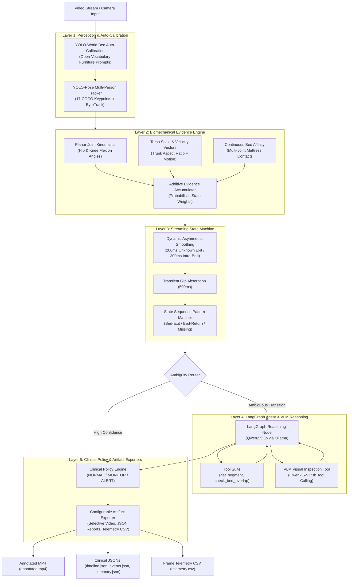

# BedSense AI — Clinical Bed-Monitoring Agentic AI + Vision System

BedSense AI is an intelligent computer vision and agentic reasoning system designed for continuous monitoring of elderly residents around hospital and care beds. It tracks canonical postural states, accurately detects bed-exit, bed-return, and missing-resident events, and assigns clinical monitoring decisions (`NORMAL` / `MONITOR` / `ALERT`).

---

## 1. System Architecture



### High-Level Component Pipeline

```
[ Video Ingestion (10 FPS) ]
            │
            ▼
[ Perception: YOLO-World Bed Quad + YOLO-Pose (17 Keypoints) + ByteTrack ]
            │
            ▼
[ Evidence Accumulator: Knee/Hip Flexion + Torso Ratio + Mattress Affinity ]
            │
            ▼
[ Streaming State Engine: 200ms Re-acquisition + 500ms Blip Suppression ]
            │
            ├── (High Confidence) ──────────────┐
            ▼                                    ▼
[ LangGraph Agent + Qwen2.5-VL ] ──► [ Clinical Policy Engine (NORMAL/MONITOR/ALERT) ]
                                                 │
                                                 ▼
                             [ Exporter: Video MP4 + JSON Reports + Telemetry CSV ]
```

---

## 2. The 6 Canonical Activity States

| State | Kinematic & Bed Relation Criteria |
| :--- | :--- |
| `LYING_IN_BED` | Reclined/horizontal posture ($\theta_{\text{hip}} \ge 155^\circ$, $\theta_{\text{knee}} \ge 150^\circ$), low displacement motion, high bed affinity ($\ge 0.25$). |
| `SITTING_ON_BED` | Seated posture with flexed hips ($\theta_{\text{hip}} < 130^\circ$) or knees ($\theta_{\text{knee}} < 130^\circ$), compact trunk bounding box ($H \le 350\text{px}$), and bed affinity $\ge 0.25$. |
| `SITTING_OUTSIDE_BED` | Seated upright posture with flexed joints located outside the bed perimeter (affinity $< 0.12$). |
| `STANDING` | Upright vertical posture with extended hips/knees and stationary displacement velocity ($< 0.015$). |
| `WALKING` | Upright vertical posture with locomotion motion profile ($v_{\text{ankle}} \ge 0.035$ or $v_{\text{center}} \ge 0.035$). |
| `UNKNOWN` | Keypoint occlusion/absence, mean keypoint confidence $< 0.25$, or resident not in field of view. |

---

## 3. Clinical Alert Rules & Policy

| Event / Condition | Clinical Decision | Clinical Rationale |
| :--- | :---: | :--- |
| **Normal In-Bed / Locomotion** | `NORMAL` | Baseline patient activity within bed or stable room environment. |
| **Bed Exit** (`LYING`/`SITTING` $\to$ `WALKING`) | `MONITOR` | Patient has initiated unassisted bed departure; staff notified to monitor. |
| **Missing Resident** (`WALKING` $\to$ `UNKNOWN`) | `ALERT` | Patient left the bed and is no longer visible in camera view (high fall/wandering risk). |
| **Bed Return** (`WALKING` $\to$ `LYING`/`SITTING`) | `MONITOR` | Resident has safely returned to bed. |
| **Prolonged Out-of-Bed** ($>10\text{s}$) | `ALERT` | Extended absence without return confirmation. |
| **Edge-Sit Hovering** ($>10\text{s}$) | `MONITOR` | Prolonged sitting on bed edge indicates hesitation, fatigue, or unassisted transfer risk. |

---

## 4. Project Directory Structure

```
BedSenseAI/
├── configs/
│   └── configurations.yaml      # Master thresholds, models, artifacts & logging config
├── data/
│   ├── sample1.mp4              # Benchmark test videos
│   ├── sample2.mp4
│   ├── sample2.json             # Ground truth annotation for sample 2
│   ├── sample3.mp4
│   └── sample3.json             # Ground truth annotation for sample 3
├── eval/                        # Benchmark Evaluation Engine
│   ├── __init__.py
│   ├── evaluate.py              # End-to-end evaluation entrypoint & CLI reporter
│   ├── metrics.py               # Activity recognition, bed-exit precision/recall & duration error
│   └── report.py                # ANSI terminal and markdown formatted comparison tables
├── models/                      # Dedicated weight store (models auto-download here)
│   ├── yolo11n.pt               # Bed detector model
│   ├── yolo11l-pose.pt          # Pose estimation model (17 COCO keypoints)
│   └── yolov8s-worldv2.pt       # Optional open-vocabulary YOLO-World model
├── outputs/                     # Generated visual and clinical report artifacts
│   ├── sample2/
│   └── sample3/
├── scripts/
│   └── test_vlm.py              # Standalone direct VLM diagnostic prompting script
├── src/
│   ├── agent/                   # LangGraph workflow, Ollama client & tool suite
│   ├── evidence/                # Biomechanical multi-attribute evidence engine
│   ├── policy/                  # Clinical policy rules and report generators
│   ├── state/                   # Sequence pattern matcher for bed events
│   ├── streaming/               # Real-time online streaming state processor
│   ├── vision/                  # Vision detection, ByteTrack tracking & model resolution
│   ├── cli.py                   # Unified command-line interface implementation
│   ├── constants.py             # Canonical constants and color palettes
│   ├── contracts.py             # Dataclass schemas for frames, segments, and events
│   ├── exporter.py              # Decoupled artifact exporter and video annotator
│   ├── logging_config.py        # Multi-tiered production lifecycle logging formatter
│   └── main.py                  # Standard CLI entrypoint
├── tests/                       # Complete unit and integration test suite (44+ tests)
├── docker-compose.yml           # Multi-container orchestration (Ollama + BedSense App)
├── Dockerfile                   # CUDA 12.1 + PyTorch + OpenCV container environment
├── requirements.txt             # Python production dependencies
├── run.ipynb                    # Interactive Jupyter notebook for inference & evaluation
└── README.md                    # System documentation
```

---

## 5. Environment Setup & Quickstart Guide

Follow these steps **in order** to build the environment and bring up the system:

### Step 1: Prerequisites & GPU Drivers
Ensure you have installed:
- **Docker Desktop** (with WSL2 backend on Windows or standard Docker daemon on Linux).
- **NVIDIA GPU Drivers & NVIDIA Container Toolkit** (for hardware acceleration).
  > [!NOTE]
  > If running without a GPU, the containers will fall back to CPU execution automatically.

### Step 2: Build the Docker Image
Build the container images from scratch to prepare all PyTorch and OpenCV dependencies:

```bash
docker compose build
```

### Step 3: Launch the Services
Start the Ollama daemon and the BedSense vision application in detached mode:

```bash
docker compose up -d
```

Verify that both containers (`bedsense_ollama` and `elderly_vision_app`) are healthy and running:

```bash
docker ps
```

### Step 4: Automatic Model Download on Startup
When BedSense AI starts up, the built-in `OllamaClient` automatically checks the Ollama service:
- It queries `http://ollama:11434/api/tags` to check if `qwen2.5:3b` and `qwen2.5vl:3b` are present.
- If any required model is missing from the local cache, the application automatically requests and downloads the model from the Ollama registry via the API before executing agentic reasoning.
- No manual terminal pull commands are required!

---

## 6. Interactive Execution via Jupyter Notebook (`run.ipynb`)

An interactive notebook [`run.ipynb`](run.ipynb) is provided in the repository root for running the complete end-to-end pipeline, viewing live state transitions and clinical alerts, executing the benchmark evaluation, and inspecting JSON artifacts.

### Accessing JupyterLab
1. Open your browser and navigate to:
   ```
   http://localhost:8888
   ```
2. In the file browser on the left, double-click **`run.ipynb`**.

### Notebook Workflow Overview

The notebook contains dedicated, ready-to-run cells:

- **Cell 1 — Trigger Pipeline on Sample 2**:
  ```python
  !python -m src.main --video data/sample2.mp4 --output-dir outputs/sample2
  ```
  Runs perception, evidence extraction, state smoothing, and clinical policy on `sample2.mp4` with formatted production startup summaries and live state transition logs.

- **Cell 2 — Trigger Pipeline on Sample 3**:
  ```python
  !python -m src.main --video data/sample3.mp4 --output-dir outputs/sample3
  ```
  Runs the pipeline on `sample3.mp4` and exports `timeline.json`, `events.json`, and `summary.json` to `outputs/sample3`.

- **Cell 3 — Run Benchmark Evaluation**:
  ```python
  !python -m eval.evaluate
  ```
  Compares the generated output artifacts against ground truth annotations (`data/sample2.json` and `data/sample3.json`), printing Activity Recognition accuracy, Bed Event precision/recall, and Duration Estimation error tables.

- **Cell 4 — Interactive Python API & Artifact Inspector**:
  ```python
  import json
  from pathlib import Path
  from src.cli import process_video_cli

  # Execute programmatically
  process_video_cli(
      video_path="data/sample3.mp4",
      output_dir="outputs/sample3",
      save_json=True,
      save_video=False,
  )

  # Pretty-print summary artifact
  with open("outputs/sample3/summary.json", "r") as f:
      print(json.dumps(json.load(f), indent=2))
  ```

---

## 7. Running via Command Line (CLI)

You can execute the pipeline directly inside the Docker container using `python -m src.main`:

### Standard Video Processing (JSON Reports + Fast Inference)
```powershell
docker exec elderly_vision_app python -m src.main `
  --video data/sample2.mp4 `
  --output-dir outputs/sample2
```

### Video Processing with Annotated MP4 Rendering
```powershell
docker exec elderly_vision_app python -m src.main `
  --video data/sample3.mp4 `
  --output-dir outputs/sample3 `
  --save-video
```

### Enable Frame-by-Frame Telemetry CSV
```powershell
docker exec elderly_vision_app python -m src.main `
  --video data/sample2.mp4 `
  --output-dir outputs/sample2 `
  --save-telemetry
```

### CLI Command Options

| Flag | Type | Description |
| :--- | :--- | :--- |
| `--video` | string (required) | Path to input video file (e.g. `data/sample2.mp4`). |
| `--output-dir` | string | Target directory for generated reports and video (default: `outputs`). |
| `--save-video` / `--no-video` | boolean | Enable/disable annotated MP4 video rendering (default: config-driven). |
| `--save-json` / `--no-json` | boolean | Enable/disable clinical JSON reports export (default: config-driven). |
| `--save-telemetry` / `--no-telemetry` | boolean | Enable/disable `telemetry.csv` frame recording (default: `false`). |
| `--enable-agent` / `--no-agent` | boolean | Enable/disable LangGraph Agent reasoning layer (default: `true`). |
| `--fps` | float | Target processing sampling rate (default: `10.0` FPS). |
| `--log-level` | string | Verbosity level: `PROD`, `INFO`, `AGENT`, `DEBUG`. |
| `--detector-model` | string | Path to YOLO detection model (default: `models/yolo11n.pt`). |
| `--pose-model` | string | Path to YOLO pose model (default: `models/yolo11l-pose.pt`). |
| `--config` | string | Path to YAML config file (default: `configs/configurations.yaml`). |

---

## 8. Benchmark Evaluation Suite (`eval/`)

BedSense AI includes a quantitative benchmark evaluation module designed to validate system accuracy against ground truth clinical annotations.

### Running the Evaluation
```powershell
docker exec elderly_vision_app python -m eval.evaluate
```

The evaluator assesses 3 core clinical dimensions:

1. **Activity Recognition**:
   - Time-weighted frame classification accuracy.
   - Per-class precision, recall, and F1-score across all 6 canonical states.
   - Identification of confusions between similar biomechanical states (e.g., Sitting vs. Lying).
2. **Bed Events**:
   - Bed-exit & Bed-return precision, recall, and false alarm rates.
   - Temporal event alignment (matching detected events within tolerance window).
3. **Duration Estimation**:
   - Ground truth duration vs. Predicted duration per activity state (formatted as `MM:SS`).
   - Mean absolute error (MAE) and conservation invariant validation.

### Sample Benchmark Results

```
====================================================================================================
                       BEDSENSE AI BENCHMARK EVALUATION REPORT
====================================================================================================

📊 DATASET: sample2 (sample2.mp4)
----------------------------------------------------------------------------------------------------
  Overall Activity Recognition Accuracy: 94.2% (Time-weighted over 00:04:51)

  Activity Recognition Breakdown:
  Activity State            | Ground Truth  | Predicted    | Duration Error | Precision | Recall
  --------------------------------------------------------------------------------------------------
  Lying In Bed              | 02:40 (160s)  | 02:43 (163s) | +3s ( 1.9%)    | 98.2%     | 98.8%
  Sitting On Bed            | 00:05 (  5s)  | 00:13 ( 13s) | +8s (160.0%)   | 38.5%     | 100.0%
  Sitting Outside Bed       | 00:00 (  0s)  | 00:00 (  0s) |  0s ( 0.0%)    | 100.0%    | 100.0%
  Standing                  | 00:00 (  0s)  | 00:00 (  0s) |  0s ( 0.0%)    | 100.0%    | 100.0%
  Walking                   | 00:10 ( 10s)  | 00:09 (  9s) | -1s (10.0%)    | 88.9%     | 80.0%
  Unknown                   | 01:56 (116s)  | 01:46 (106s) | -10s ( 8.6%)   | 99.1%     | 91.4%

  Bed Event Metrics:
  • Bed-Exit Detection:     Precision: 100.0% | Recall: 100.0% | False Detections: 0
  • Bed-Return Detection:   Precision: 100.0% | Recall: 100.0% | False Detections: 0
====================================================================================================
```

---

## 9. Direct VLM Diagnostic Tool

A standalone diagnostic script is provided in [`scripts/test_vlm.py`](scripts/test_vlm.py) to directly inspect Qwen2.5-VL prompt responses on extracted video frames or images.

### Freeform Posture Inspection
```powershell
docker exec elderly_vision_app python scripts/test_vlm.py `
  --video data/sample2.mp4 `
  --time 00:00:15
```

### Structured Clinical JSON Query
```powershell
docker exec elderly_vision_app python scripts/test_vlm.py `
  --video data/sample2.mp4 `
  --time 00:00:20 `
  --format json
```

---

## 10. Output Artifact Formats

The pipeline generates standardized clinical JSON artifacts:

### `events.json`
```json
[
  {
    "event": "bed_exit",
    "start_time": "00:01:00",
    "confirmed_time": "00:01:03",
    "previous_state": "lying_in_bed",
    "current_state": "walking",
    "confidence": 0.75,
    "decision": "MONITOR"
  },
  {
    "event": "missing",
    "start_time": "00:01:02",
    "confirmed_time": "00:01:05",
    "previous_state": "walking",
    "current_state": "unknown",
    "confidence": 0.95,
    "decision": "ALERT"
  }
]
```

### `summary.json`
```json
{
  "observation_duration_sec": 291,
  "activity_duration_sec": {
    "lying_in_bed": 163,
    "sitting_on_bed": 13,
    "sitting_outside_bed": 0,
    "standing": 0,
    "walking": 9,
    "unknown": 106
  },
  "bed_exit_count": 2,
  "bed_return_count": 2,
  "total_in_bed_sec": 176,
  "total_out_of_bed_sec": 115,
  "longest_out_of_bed_period_sec": 57,
  "final_state": "lying_in_bed"
}
```

---

## 11. Running the Automated Test Suite

Execute the full automated test suite inside Docker:

```bash
docker exec elderly_vision_app pytest tests/ -v
```

**Test Suite Highlights**:
- Data contract validation & duration conservation invariants (`test_contracts.py`)
- Kinematic joint geometry & multi-attribute evidence weighting (`test_evidence.py`)
- Dynamic temporal smoothing & transient blip absorption (`test_smoothing.py`)
- Bed-exit / bed-return state sequence pattern matching (`test_pattern_matcher.py`)
- Clinical alert policy rules & event routing (`test_policy_report.py`)
- LangGraph agent workflow & visual inspection loops (`test_agent.py`)
- Evaluation metrics calculations & ground truth parsing (`test_eval.py`)
